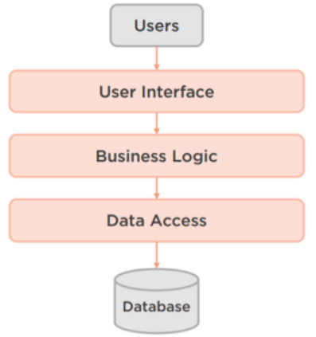

# Introduction à la clean architecture

## Objectif
Ce Document a pour but de donner un aperçu de la clean architecture, de ce qu'elle est et de son importance. Ensuite, nous analyserons ce qu’ on appelle les architectures centrées sur les domaines (domain centric architectures) et pourquoi il serait intéressant de placer notre modèle de domaine au centre de notre architecture.

#### En quoi consiste l'architecture logicielle ?
> “L’architecture logicielle décrit d’une manière symbolique et schématique les différents éléments d’un ou de plusieurs systèmes informatiques, leurs interrelations et leurs interactions. Contrairement aux spécifications produites par l’analyse fonctionnelle, le modèle d'architecture, produit lors de la phase de conception, ne décrit pas ce que doit réaliser un système informatique mais plutôt comment il doit être conçu de manière à répondre aux spécifications. L’analyse décrit le « quoi faire » alors que l’architecture décrit le « comment le faire ».”  [wikipedia]

#### Messy VS Clean Architecture

On a tous une idée générale de ce à quoi ressemble une architecture désordonnée par rapport à une architecture propre. En outre, cette perception convient très bien à deux types de cuisine italienne tout aussi délicieux l'un que l'autre. Tout d'abord, l'architecture désordonnée ressemble beaucoup à des spaghettis.

Ce n'est qu'un tas de code pas du tout propre avec une boulette de viande jetée ici ou là. Il est presque impossible de se repérer facilement le début et la fin d'une nouille, et il est très difficile d'ajouter ou de remplacer une nouille sans perturber toutes les avoisinantes. Ensuite, une bonne architecture propre ressemble à des lasagnes. Elle possède de belles limites de nouilles, cohérentes et horizontales, qui divisent uniformément les différentes couches de garniture. Lorsqu'un morceau est trop gros, nous le découpons en plus petits éléments avec des lignes orthogonales, nettes, avec une belle couche de présentation qui se superpose à une pile de fonctionnalités mangeables.

**1. Messy Architecture**

**Ainsi, sur un plan plus technique, qu'est-ce qu'une mauvaise architecture ou une architecture désordonnée ?**

Eh bien, C'est une architecture complexe, mais qui est due à une complexité non pas nécessairement voulue, mais plutôt à une complexité accidentelle. C'est incohérent dans le sens où les pièces ne semblent pas s'emboîter les unes dans les autres. C'est rigide, c'est-à-dire que l'architecture peut résister au changement ou rend difficile l'évolution de l'architecture dans le temps. C'est fragile, toucher une partie du code peut en briser une autre ailleurs, C'est non testable, c'est-à-dire que vous aimeriez vraiment écrire des tests unitaires et des tests d'intégration, mais l'architecture vous résiste à chaque étape du processus, et finalement, toutes ces choses mènent à une architecture qui n'est pas maintenable pendant la durée de vie du projet

**2. Clean Architecture**

**D'autre part, une architecture est considérée comme Clean :**

Lorsqu'elle est simple ou du moins complexe, et que cette complexité n'est pas accidentelle. Elle est compréhensible, c'est-à-dire qu'il est facile de comprendre le logiciel dans son ensemble, Elle est flexible, nous pouvons facilement adapter le système pour répondre à des exigences changeantes. Elle est évolutive, l'architecture évolue tout au long de la vie du projet. Elle est testable, l'architecture rend les tests plus faciles. Finalement tout cela conduit à une architecture qui est plus facile à maintenir tout au long de la vie du projet.

**Pourquoi et comment utiliser la clean architecture ?**

Pour résumer le fonctionnement d’une Clean l'architecture :

- C’est une architecture conçue pour les habitants de l'architecture, et non pour
- l'architecte ou la machine.

Il s'agit de se concentrer sur ce qui est vraiment essentiel à l'architecture du logiciel par rapport à ce qui n'est qu'un détail d'implémentation. Par conception pour les habitants, nous entendons les personnes qui vivront au sein de l'architecture pendant la durée de vie du projet. Cela signifie les utilisateurs du système, les développeurs qui construisent le système et les développeurs qui le maintiennent. Par "ne pas concevoir pour l'architecte", nous entendons que l'architecte doit mettre de côté ses propres désirs, préférences et souhaits, et ne considérer que ce qui est le mieux pour les habitants de l'architecture à chaque décision prise.

En ne concevant pas pour la machine, cela signifie que nous devons d'abord optimiser l'architecture pour les besoins des habitants, c'est-à-dire les utilisateurs et les développeurs, et n'optimiser pour la machine que lorsque le coût des problèmes de performance pour les utilisateurs, qui sont les habitants de l'architecture, l'emporte sur les avantages d'une conception propre pour les développeurs qui sont également les habitants de l'architecture. En gros, il faut éviter l'optimisation prématurée. Veuillez noter que c'est le point clé de tout ce document. Si vous ne retirez qu'une seule chose de ce document, qu'elle soit la suivante. Nous devons d'abord concevoir notre architecture pour les habitants de l'architecture, tout le reste, notre ego, les nouveaux cadres brillants, l'optimisation des performances, etc. devrait être une préoccupation secondaire.

**Pourquoi investir dans la Clean Architecture ?**

La véritable motivation pour investir dans la clean architecture est principalement une question de coût et de rentabilité. En tant qu'architectes de logiciels, le but est de minimiser les coûts de création et de maintenance des logiciels tout en maximisant le bénéfice que représente la valeur commerciale que les logiciels apportent. Ainsi, le but principal est de maximiser le retour sur investissement, c'est-à-dire le retour sur investissement du projet logiciel dans son ensemble. La clean architecture tente d'atteindre cet objectif de plusieurs façons. Tout d'abord, elle se concentre sur les besoins essentiels des principaux occupants ( voir la section d’avant ) du système, c'est-à-dire les utilisateurs. Nous essayons de construire un système qui reflète les cas d'utilisation et les modèles conceptuels des utilisateurs en intégrant ces derniers dans notre architecture et notre code. Deuxièmement, une architecture propre ne construit que ce qui est nécessaire quand c'est nécessaire. Nous essayons de créer uniquement les fonctionnalités et l'architecture correspondante qui sont nécessaires pour répondre aux besoins immédiats des utilisateurs, en fonction de la valeur commerciale perçue de chaque fonctionnalité. Nous essayons de le faire sans créer de complexité accidentelle, de fonctionnalités inutiles, d'optimisations prématurées des performances ou de perfectionnements architecturaux.

Cela permet de réduire le coût de création du système. Troisièmement, une architecture propre optimise la maintenabilité. Pour une application d'entreprise moyenne ayant un cycle de vie suffisamment long, disons 10 ans environ, nous consacrons beaucoup plus de temps et d'argent à la maintenance du système qu'à sa création. Donc si nous optimisons pour la maintenabilité, ce que fait la clean architecture , nous réduisons en théorie le coût de la maintenance du système. En se concentrant sur les activités de valeur ajoutée et de réduction des coûts, on tente de maximiser le retour sur investissement du logiciel dans son ensemble. En outre, la clean architecture offre plusieurs autres avantages en termes de valeur ajoutée et de réduction des coûts .

**Le contexte est roi au pays de l'architecture :**

Le choix d’une architecture dépend vraiment de plusieurs contraintes et objectifs d'optimisation souvent contradictoires auxquels l'architecture est soumise, dont beaucoup échappent au contrôle de l'architecture. Chaque fois que nous prenons une décision architecturale, nous échangeons une chose contre une autre. Souvent, nous échangeons un type de complexité que nous ne voulons pas contre un autre type de complexité que nous ne voulons pas non plus, mais que nous préférerions avoir par rapport au premier type de complexité. Comme nous l'avons mentionné précédemment, l'objectif ultime d'un architecte est de prendre des décisions qui permettent d'échanger des choses comme la complexité, de manière à minimiser les coûts et à maximiser la valeur commerciale, et donc à maximiser le retour sur investissement du projet logiciel dans son ensemble.

Dans de nombreux cas, ces modèles, pratiques et principes que nous allons découvrir ne permettent pas de minimiser les coûts ou de maximiser la valeur commerciale de votre projet spécifique en raison du contexte spécifique qui entoure votre projet et votre entreprise dans son ensemble. Il est très important pour l'architecte de comprendre les objectifs de l'entreprise et le contexte dans lequel elle évolue, puis d'aligner l'architecture sur les objectifs de l'entreprise et ce contexte