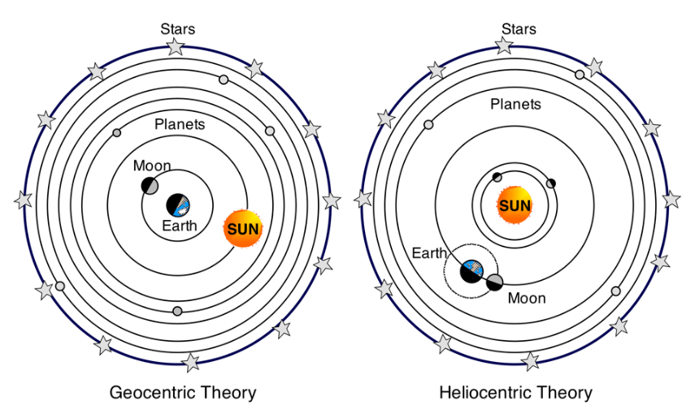
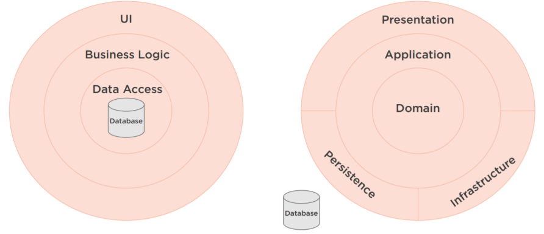

# Introduction

> **Nous savons tous que la terre est au coeur du système solaire, et que le soleil, la lune et les planètes tournent autour de la terre. C'est exact ?
Aujourd'hui, ce n'est plus le cas, mais ça l'était à une époque. Cependant, un homme très intelligent du nom de Nicolas Copernic a changé la
façon dont nous percevons notre système solaire. Au lieu de supposer que la terre était au centre du système solaire, Nicolas Copernic a eu
cette idée folle que le soleil pourrait être au centre de notre système solaire à la place. Ce changement de vision a permis de construire un
meilleur modèle du système solaire, en ce sens qu'il est à la fois plus simple et plus explicatif. Il s'agit essentiellement d'un modèle plus élégant
de notre système solaire.**

> **Un changement de vision similaire se produit dans le monde de l'architecture logicielle. Nous avons en-dessus à gauche, l'architecture classique
à trois couches, centrée sur les bases de données. Sa caractéristique principale est que l'interface utilisateur, la logique métier et la couche
d'accès aux données reposent sur la base de données. La base de données est essentielle, et donc, elle est au centre de cette architecture.
Cependant, une nouvelle perspective a changé la façon dont beaucoup d'entre nous abordent leur architecture. Au lieu d'avoir la base de
données au centre, certains placent plutôt le domaine au centre et font de la base de données un simple détail d'implémentation en dehors de
l'architecture. Ici, le domaine est essentiel, et la base de données n'est qu'un détail.**

##Essentiel vs Détail

> “The first concern of the architect is to make sure that the house is usable, it is not to ensure that the house is made of brick.”
[Uncle Bob](https://fr.wikipedia.org/wiki/Robert_C._Martin)

Ce changement de perspective est parfaitement résumé par une citation de Robert C. Martin, connu dans l'industrie du logiciel sous le nom d'Oncle Bob.

Il dit que "la première préoccupation de l'architecte est de s'assurer que la maison est utilisable, il ne s'agit pas de s'assurer que la maison est en brique. 

Ce changement de perspective architecturale est dû à un changement de ce qui est essentiel dans une architecture par rapport à ce qui n'est qu'un détail de mise en œuvre.

En appliquant le concept de l'architecture du bâtiment, quand nous construisons une maison, qu'est-ce qui est essentiel par rapport à ce qui est un détail ? L'espace à l'intérieur d'une maison est essentiel. Sans espace vide pour habiter la maison, celle-ci ne servirait à rien.

L'utilité de la maison est essentielle. Si la maison ne contenait pas de pièces et de caractéristiques pour répondre à nos besoins primaires, encore une fois, la maison ne servirait pas son but. Cependant, le matériau de construction n'est qu'un détail de mise en œuvre.

Nous pourrions la construire en brique, en pierre, en bois ou en bien d'autres matériaux. De plus, la décoration n'est qu'un détail. 
Nous pourrions toujours vivre dans cette maison, qu'elle soit dotée de moulures victoriennes, de garnitures dorées, de portes françaises ou qu'elle ne soit pas ornée du tout.
Les choses qui sont essentielles dans une maison le sont parce qu'elles répondent aux besoins primaires des habitants ( utilisateur ) de la maison.
Tout le reste n'est qu'un détail. Il en va de même pour la clean architecture . Ce qui est essentiel, ce sont les choses qui répondent aux besoins primaires des habitants (utilisateurs) de l'architecture.
Le domaine est essentiel. Sans lui, le système ne représenterait pas les modèles métiers des utilisateurs.

Les cas d'utilisation sont essentiels. Sans eux, le système ne résoudrait pas les problèmes des utilisateurs. Cependant, la présentation n'est qu'un détail. Nous pouvons fournir l'interface utilisateur sous forme de sites web, ASP. NET MVC ou comme une ASP ( application single page), et la persistance n'est qu'un détail. 
Nous pouvons stocker les données dans une base de données relationnelle, No-SQL, ou sous forme de simples fichiers JSON. Attention, les technologies d’interfaçage et de persistance sont très importantes.
Elles ne sont tout simplement pas essentielles pour résoudre le problème que l'utilisateur tente de traiter avec l'application.

## Database-centric ( orientée base de données ) vs Domain-centric ( Orientée Domaine métier ).

> To be Continued ...