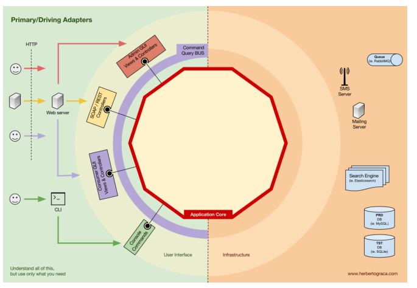
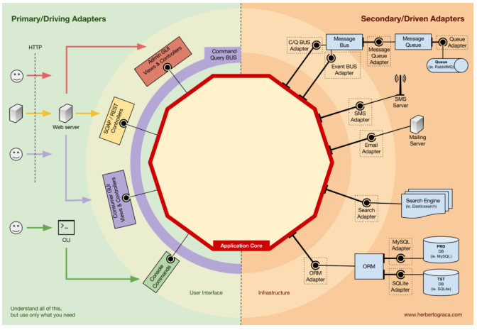
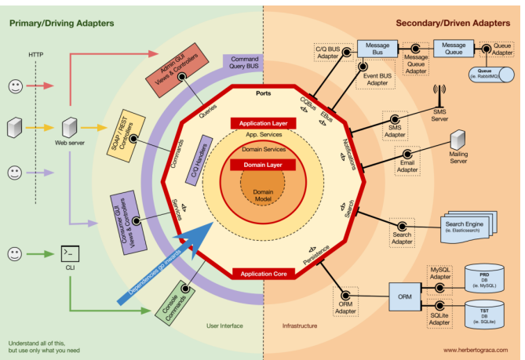
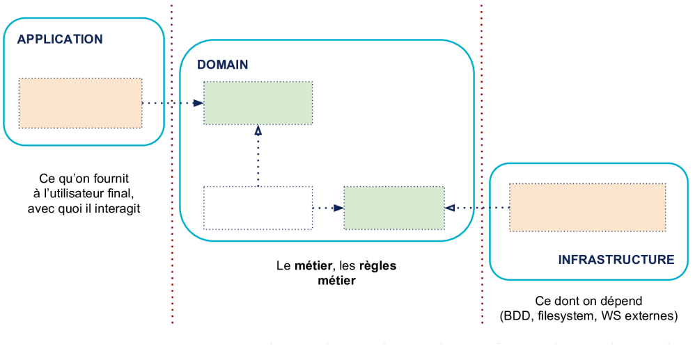

# Architecture Hexagonale

## Introduction

> Avant d'entrer dans les détails de l'architecture hexagonale, il
> convient de se demander ce qui justifie la nécessité de préserver le
> modèle. Dans la plupart des logiciels, c'est la logique métier mise en
> œuvre qui constitue la plus grande valeur ajoutée puisque c'est cette
> logique qui rend le logiciel fonctionnel. Pourtant, très souvent, un
> grand nombre de développements se concentrent sur d'autres parties
> telles que l'interface graphique, la persistance des données ou le
> partage des informations avec des systèmes externes.

L'idée est donc d'essayer de préserver ce qui représente la plus grande valeur ajoutée d'une application : **la logique métier**.

La première étape consiste à comprendre ce qui correspond à la logique métier et ce qui appartient aux processus techniques qui n'en ont pas. Cette approche peut être développée davantage en examinant la conception pilotée par le domaine (ou Domain Driven Design DDD), qui fournit des conseils sur la manière d'isoler la logique métier.

Le **DDD** est une démarche et une approche pour aborder les domaines particulièrement complexes qui repose sur le principe de faire du domaine lui-même l'objet principal du projet, et de maintenir un modèle logiciel qui reflète une compréhension approfondie du domaine.

Pour bien comprendre le DDD je vous invite à lire les articles suivants :

- [domain-driven-design-en-5-min](https://cdiese.fr/domain-driven-design-en-5-min)
- [craft-les-patterns-tactiques-du-ddd](https://blog.engineering.publicissapient.fr/2018/06/25/craft-les-patterns-tactiques-du-ddd)

### Les différentes couches de l’architecture

- **Couche d'interface utilisateur ( UI )** - Permet d'afficher des informations aux utilisateurs finaux et de les faire interagir avec le système.
- **Couche d'application** - Orchestrer les objets du domaine pour exécuter les tâches requises par les utilisateurs finaux.
- **Couche de domaine** - Comprend toute la logique métier, les entités, les événements et tout autre type d'objet qui contenant la logique métier.
- **Couche infrastructure** - fonctionnalités techniques qui prennent en charge les couches ci-dessus, comme la couche réseau par exemple.
- **Couche Persistance** - Permet de gérer la partie Persistance du service.

**DataBanding**

La communication entre les couches peut seulement se faire de manière **descendante**, autrement dit une couche ne peut jamais communiquer directement avec une couche située au-dessus d'elle. Dans une approche stricte, une couche ne peut parler qu'à une couche située directement en dessous d'elle, tandis que l'approche souple permet à une couche de parler à toutes les couches situées en dessous d'elle. Généralement, la couche "interface utilisateur" est appelée "Front End" de notre application et la couche "infrastructure" est appelée "Back End". La partie "intermédiaire", appelée noyau, mais vous pouvez aussi l'appeler le domaine, la logique métier.

La plupart des nouvelles architectures considèrent qu'il n'y a pas de grande différence entre l'interface utilisateur (client web ou application mobile) et la base de données. Un système n'est constitué que de deux parties distinctes : interne, externe. La partie interne est le noyau et la partie externe est l'endroit où vivent l'interface utilisateur et l'infrastructure. Ainsi, selon cette conception du système, notre base de données et notre client web ne sont plus des éléments de premier et de second plan. Ils sont tous deux identiques, en extérieur du système.

Si nous souhaitons que notre noyau puisse communiquer avec le monde extérieur, il est nécessaire de trouver un moyen de formater les données issues du monde extérieur en quelque chose que notre noyau puisse comprendre (et vice versa). Par exemple, notre client web utilise le protocole HTTP alors que notre application utilise Nodejs. Par conséquent, notre noyau doit être entouré d'un autre hexagone.

Dans cette enveloppe, les requêtes HTTP seront transformées en une structure de données Nodejs que notre noyau pourra comprendre, et vice versa. Il en va de même pour notre base de données. Nous avons besoin d'un moyen de transformer notre structure de données Nodejs (probablement des objets) en un format de notre base de données (souvent des tables Non/relationnelles). C'est là que vivent les ports et les adaptateurs.

## Ports & Adapters

**1. Port**

Un port n'est rien d'autre qu'une spécification de la manière dont l'outil peut utiliser le noyau d'application, ou de la manière dont il est utilisé par le noyau d'application. Il est important de noter que les ports (interfaces) appartiennent à la logique métier, tandis que les adaptateurs appartiennent à l'extérieur.

Il est essentiel que les ports soient créés pour répondre aux besoins du cœur de l'application et non pas simplement pour imiter les API des outils. Ils traduisent tout ce qui provient d'un mécanisme de distribution en un appel de méthode dans le noyau d'application.

Le port peut etre par exemple une interface web ou webservice REST ou SOAP et si nous voulons par exemple permettre au monde externe de communiquer autrement avec notre noyau. Par exemple avec un CLI. Tout ce que nous avons à faire est d'écrire un autre adaptateur qui prendra l'entrée du CLI et la transformera en un format compréhensible par notre noyau. Il faut noter que nous n'avons pas eu besoin de toucher au code de notre noyau pour prendre en charge une nouvelle méthode de communication permettant au monde extérieur de parler à notre système. Notre noyau est totalement ignorant des nombreuses façons de communiquer avec notre système depuis l'extérieur.

**2. Adapters**

Les Adapters est Ils permettent de transformer l'interface d'entrée de l'adaptateur en une interface d'entrée que la cible pourra utiliser.

Supposons par exemple que nous avons une application qui a besoin de données persistantes. Nous créons donc une interface de persistance qui répond à ses besoins, avec une méthode pour sauvegarder un tableau de données et une méthode pour supprimer une ligne dans un tableau par son ID.

À partir de là, quel que soit l'endroit où notre application a besoin de sauvegarder ou de supprimer des données, nous aurons besoin dans son constructeur d'un objet qui implémente l'interface de persistance que nous avons définie.

Nous créons maintenant un adaptateur spécifique à MySQL qui implémentera cette interface. Il aura les méthodes pour enregistrer un tableau et supprimer une ligne dans un tableau, et nous l'injecterons partout où l'interface de persistance est nécessaire.

Si, à un moment donné, nous décidons de changer de base de données, par exemple pour PostgreSQL ou MongoDB, il nous suffit de créer un nouvel adaptateur qui implémente l'interface de persistance et qui est spécifique à PostgreSQL, et d'injecter le nouvel adaptateur au lieu de l'ancien.

> Une spécificité à noter à propos de l’architecture hexagonale c’est
> les adapters et ports dépendent d'un outil, plateformes spécifiques.
> Ce qui est pas le cas pour la logique métier ne dépend d’aucun outil
> spécifique.

La façon dont nous faisons la distinction entre le port et les adapters est basée sur la communication avec le noyau. Dans le cas des ports, ce sont eux qui initient la communication avec notre noyau (qui pilote le comportement de notre application), tandis que dans le cas des adapters, la communication avec ces derniers est initiée par notre noyau.

## Avantages

L'utilisation de ports et adapters ajoutera une certaine complexité à votre architecture et à votre conception (comme n'importe quelle conception ou modèle architectural).

**Retarder les décisions techniques** : Il existe un paradoxe avec les projets. Souvent, nous faisons de grands choix techniques au début de nos projets alors que notre connaissance du projet (domaine) est au minimum. Notre connaissance du domaine ne fera que s'accroître avec le temps, alors ne serait-il pas bien de pouvoir reporter ces décisions techniques dans le futur ? Eh Bien, avec les ports et les adaptateurs, nous pouvons le faire. Par exemple, vous êtes au début du projet et vous expérimentez la conception de votre domaine. Vous ne savez pas comment cela va se passer et vous ne savez donc pas quel type de base de données vous voulez utiliser. Ce que vous pouvez faire, c'est écrire vos adaptateurs (dépôts) en PHP simple, peut-être simplement sérialiser vos entités et les stocker dans un fichier texte (et vice versa). Cette solution n'est certainement pas adaptée à la production, mais elle vous permettra de modéliser votre domaine et de le tester, et une fois que vous serez beaucoup plus sûr de votre domaine, vous pourrez choisir votre base de données et écrire de véritables adaptateurs pour celle-ci.

**Changer de technologie :** L'architecture des ports et des adaptateurs rend relativement facile le changement des choix technologiques une fois que nous les avons faits. Il se peut que le choix que nous avons fait soit inapproprié, ou qu'il y ait simplement une nouvelle technologie plus performante que nous souhaitons utiliser. Eh bien, passer d'une technologie à l'autre est simplement une question d'écriture de nouveaux adaptateurs pour ces technologies. Bien sûr, cela peut être un travail difficile, mais il s'agit d'écrire un nouveau code, qui est toujours plus propre que la modification du code existant.

**Testabilité :** En ce qui concerne les tests, l'architecture des ports et des adaptateurs nous permet de tester réellement notre application indépendamment des dépendances externes. Du côté de la gestion, nous pouvons échanger nos adaptateurs réels avec des adaptateurs de test (notre suite de tests)

**Focus sur le noyau :** Nous avons mentionné précédemment que notre noyau est totalement ignorant du monde extérieur. La seule chose dont notre noyau se soucie, ce sont les ports qu'il fournit au monde extérieur. Cela vous permet de ne pas être influencé par des décisions technologiques lors du développement de votre noyau, de sorte qu'il puisse être véritablement axé sur le domaine plutôt que sur la technologie (framework). Le fait que votre noyau soit entièrement libre de toute influence technologique est peut-être un peu idéaliste, mais cette architecture vous offre néanmoins un niveau élevé de découplage entre votre logique de domaine métier et les technologies que vous utilisez. Et c'est une des raisons principales pour lesquelles l'architecture hexagonale a gagné tant de popularité dans la communauté de la conception pilotée par le domaine.

## Le noyau de l’application

**1. La couche Application**

C'est le moyen permettant à l'utilisateur ou à des programmes externes d'interagir avec l'application. Il contient le code qui permet ces interactions. En général, votre code d'interface utilisateur, vos routes HTTP vers une API, vos sérialisations JSON vers des programmes qui consomment votre application se situent dans cette partie. C'est le côté où vous trouvez les éléments qui pilotent (use-case) le domaine. La couche application est organisée en deux parties : use-case et ports ( voir section d’avant)

1.2  Cas d’utilisation ( use-case )

Les cas d'utilisation sont les processus qui peuvent être déclenchés dans notre noyau d'application par une ou plusieurs interfaces utilisateur de notre application. Ces cas d’utilisation répondent souvent à des problématiques métier et non pas techniques. Les use-case sont organisés en :

- **Queries** - Renvoient un résultat et ne modifient pas l'état du système.
- **commands** - Change l'état d'un système mais ne renvoie pas de valeur.

**2. La couche Domaine**

C’est la partie que l’on veut isoler de ce qui est à gauche et à droite. On y trouve tout le code qui concerne et implémente la logique métier. Le vocabulaire métier et la logique purement métier, ce qui se rapporte au problème concret que résout votre application, tout ce qui en fait la richesse et la spécificité est au centre. Dans l’idéal, un expert du métier qui ne sait pas coder pourrait lire un bout de code de cette partie sans difficulté.

